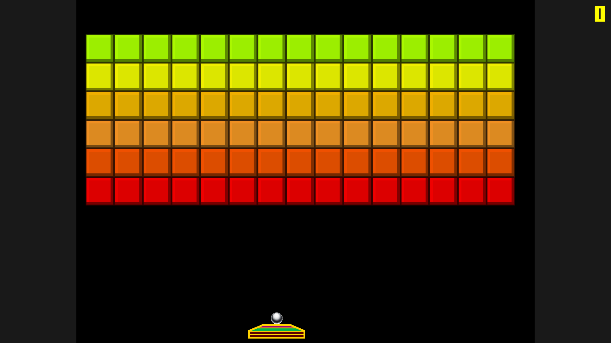
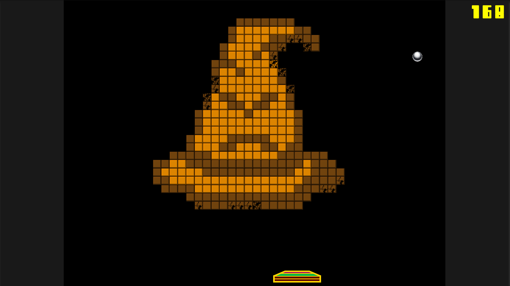

# Code Breaker
A prototype of a breakout-style game with 5 stages. This game lacks some survivability mechanics and it's not fair AT ALL, play at your own risk >.<. Created using Unity 2018.2 and updated to Unity 2020.3. There is 4 kind of blocks that only vary on the number of ball hits to destroy them:
- 1 hit 
- 2 hits
- 3 hits
- indestructible

**Stage 01:** 

**Stage 05(Last Stage):** 

